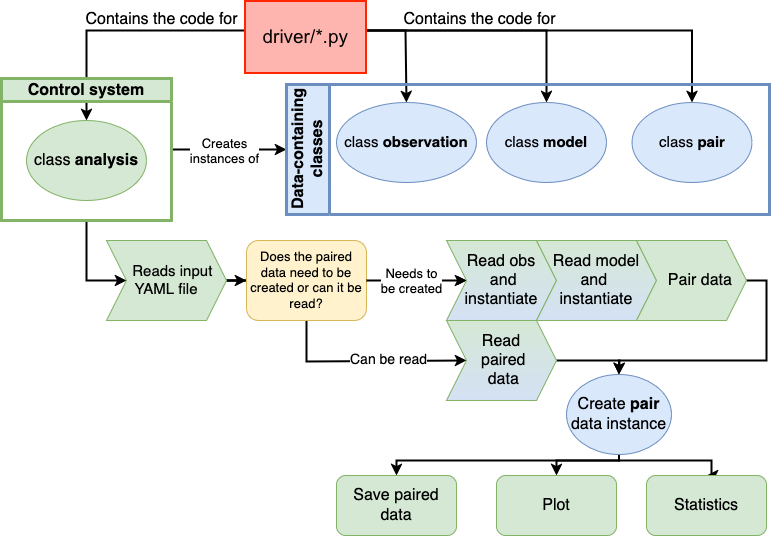

Developer's Guide
=================

The instructions in this Developer's Guide are only for developers. If you are a user of
MELODIES MONET, please follow the instructions on :doc:`../getting_started/installation` instead to setup your 
environment for running MELODIES MONET.

If you want to begin developing MELODIES MONET, you will need to set up a new development environment. To set up a
development environment where you only want to test development features, but not contribute new code back follow 
the instructions below under `Setting up Your Development Environment for Testing Only`_. 
Please use our code that is under development with caution because this code is still being tested prior to release. To
set up a development environment where you want to contribute code back to either MONET, MONETIO, and/or MELODIES MONET
repositories, follow instructions under `Setting up Your Development Environment to Contribute Code`_. For special
considerations for contributing code to our ReadTheDocs page, see the `Contributions to the Docs`_ section.

Prior to setting up your new development environment, please read through our `Description of Branches`_ to 
understand which branches are available and our `Code workflow`_ sections to better understand how the 
MELODIES MONET code is structured.

.. note::
   If you are installing MELODIES MONET on NCAR Casper or NOAA Hera
   please refer to these machine specific instructions.

   - :ref:`NCAR Casper <appendix/machine-specific-install:NCAR HPC Derecho/Casper>`
   - :ref:`NOAA Hera <appendix/machine-specific-install:NOAA HPC Hera>`

.. important::
   The instructions below are for cloning a repository using SSH.
   If you prefer, you can also clone the monet, monetio, and
   MELODIES-MONET repositories using HTTPS [#clone]_.

Description of Branches
-----------------------

This section describes the branches on our GitHub repository: `<https://github.com/NCAR/MELODIES-MONET>`__. 

There are several primary repository branches
for specific development tracks.

main
____
This is the stable release branch.
It is updated from the **develop** branch
and tagged prior to each release.
The melodies-monet conda package is created from **main**.
We do not accept updates directly to this branch from the community.
If you want to contribute updates, please submit a pull request to our **develop** or **develop_project** branches.

develop
_______
This is the parent branch in which
to consolidate the various development tracks.
If you want to contribute updates, please follow the instructions below
to fork our GitHub repository and submit a pull request to our **develop** branch with your changes.

develop_project
_______________
Sometimes temporary project branches are created from the **develop** branch
for the development team to collaboratively develop code and these are named as our 
**develop_project** branches. Make sure to consult with someone on the development team 
prior to using these **develop_project** branches as they do not always reflect our latest code updates.

Code workflow
-------------

The way the code is constructed (see :doc:`../getting_started/software_architecture`)
is based largely on code contained within the ``driver`` folder.
The main class, contained in ``driver/_analysis.py``, is ``analysis``.
``analysis`` is in charge of creating and managing all other classes.
The driver folder also contains the ``observation``, ``model`` and ``pair`` classes,
in the ``driver/_observation.py``, ``driver/_model.py``, and ``driver/_pair.py`` files, respectively,
using the tools that can be found in the ``util`` folder.
Even though, right now, the driver code is quite large,
we are working on reducing its complexity and,
as far as possible, managing most with specific utilities.

   
   Generalized structure of the code and its workflow.

.. _dev-install-instructions:

Setting up Your Development Environment for Testing Only
--------------------------------------------------------

To set up a development environment where you only want to test development features, but not contribute new code back
follow these instructions. Note please use our development code with caution as this code is under development and as
such is still being tested. We often update MONET, MONETIO, and MELODIES MONET together, so if you use the develop 
branch of one, you should use the develop branch of all of them for consistency.

(a) Set up a conda environment with all the dependencies, including MONET and 
    MONETIO::

       $ conda create --name melodies-monet-dev-test python=3.11
       $ conda activate melodies-monet-dev-test
       $ conda install -y -c conda-forge pyyaml pandas=2 monet monetio \
         "netcdf4<1.7" "setuptools<70" "dask>=2024.2.1" wrf-python \
         metpy windrose statannotations \
         typer rich pooch jupyterlab

(b) Now, install the **develop** branch of **MELODIES MONET** to the environment::

    $ pip install --force-reinstall --no-deps https://github.com/NCAR/MELODIES-MONET/archive/develop.zip

(c) Now, install the **develop** branch of **MONET** to the environment::

    $ pip install --force-reinstall --no-deps https://github.com/NOAA-OAR-ARL/MONET/archive/develop.zip

(c) Now, install the **develop** branch of **MONETIO** to the environment::

    $ pip install --force-reinstall --no-deps https://github.com/NOAA-OAR-ARL/MONETIO/archive/develop.zip

(d) Now when you activate your **melodies-monet-dev-test** environment you will be using the develop branches of 
    MONET, MONETIO, and MELODIES MONET. If updates are made to any of these branches, you only need to re-run steps 
    b through c, with your environment activated to use the latest updates.

Setting up Your Development Environment to Contribute Code
----------------------------------------------------------

To set up a development environment where you can contribute code back to either MONET, MONETIO, and/or MELODIES MONET
repositories, follow these instructions. These instructions assume you may contribute code back to all three of these
repositories. If you are only planning on submitting code to say MONETIO and MELODIES MONET, but not MONET, you can 
follow the instructions below for setting up your environment with MONETIO and MELODIES MONET and the instructions in
`Setting up Your Development Environment for Testing Only`_ for MONET.

In order to contribute code to MELODIES MONET, MONET, or MONETIO, you will need to fork these repositories, make 
changes on your fork, and submit a pull request with your changes to the develop branches.

(a) Set up a conda environment with all the dependencies, including MONET and 
    MONETIO::

       $ conda create --name melodies-monet-dev-update python=3.11
       $ conda activate melodies-monet-dev-update
       $ conda install -y -c conda-forge pyyaml pandas=2 monet monetio \
         "netcdf4<1.7" "setuptools<70" "dask>=2024.2.1" wrf-python \
         metpy windrose statannotations \
         typer rich pooch jupyterlab

(b) Fork the GitHub repositories to your own GitHub account
    using the "Fork" button near the top right for the following repositories:

    * https://github.com/NCAR/MELODIES-MONET
    * https://github.com/NOAA-OAR-ARL/MONET
    * https://github.com/NOAA-OAR-ARL/MONETIO

    .. note::
       You can pull updates from the main NCAR repository
       by using the "Sync fork" button on your fork on the develop branch.
       Alternatively, you can "Fetch Upstream" via the command line: [#clone]_ ::

          $ git remote add upstream git@github.com:NCAR/MELODIES-MONET.git
          $ git pull upstream develop
          $ git push origin develop

(c) Clone [#clone]_ and link the latest development version of MELODIES MONET via your fork:
    
    Navigate on your working machine
    to where you would like to keep the MELODIES-MONET code
    (e.g. in your work location) and clone [#clone]_ your fork::

       $ git clone git@github.com:$GitHubUsername/$ForkName.git

    Checkout the develop branch --- you need to do this with the remote branch
    as well as create a local tracking branch::

       $ cd $ForkName
       $ git checkout origin/develop
       $ git checkout -b develop_new
       $ pip install --force-reinstall --no-deps --editable .

    Then all development work will be in the ``melodies_monet`` folder. ::

       $ cd melodies_monet

(d) Repeat step c for MONET and MONETIO code repositories.

(d) Make changes and push these updates to your forks on GitHub::

       $ git add [Your_Updated_File_Name]
       $ git commit -m "A brief mesage about your update"
       $ git push -u origin develop_new

(e) Submit a pull request back to the main MELODIES MONET, MONET, and/or MONETIO repositories with your
    changes to the **develop** branches. Be sure to include a thorough description of your changes.

Contributions to the Docs
-------------------------

If you add a component to MELODIES MONET, please follow the instructions below 
to update the ReadTheDocs user guide. 

This User's Guide has been generated by the Sphinx documentation system.
This requires adding the following packages to your conda environment in
order to build the HTML docs.

Either use the ``docs/environment-docs.yml`` file [#env]_
from the MELODIES MONET repository,
or add the following packages to your conda environment manually::

    $ conda install -y -c conda-forge sphinx=7.* sphinx_rtd_theme myst-nb>=0.14 sphinx-design \ 
      sphinx-click sphinx-togglebutton typer

The restructured text sources (rst) are located
in the ``MELODIES-MONET/docs`` folders.
The rst files may be edited and new files added
to document any package modifications
or new MELODIES MONET components.

To build the HTML docs::

    $ cd docs
    $ make clean
    $ make html

The generated HTML will be created in ``docs/_build/html``,
with ``docs/_build/html/index.html`` the main page that can be
viewed in any browser.

Please refer to the
`MELODIES MONET project board <https://github.com/orgs/NCAR/projects/150/>`__ 
to learn more about our current and future documentation plans.

.. _clone-notes:
.. [#clone] Note that in order to do an SSH clone,
   e.g. ::

      $ git clone git@github.com:noaa-oar-arl/monet.git

   you must have already
   `added an SSH key <https://docs.github.com/en/authentication/connecting-to-github-with-ssh/adding-a-new-ssh-key-to-your-github-account>`__
   to your GitHub account for your current machine.
   If you are new to GitHub, check out

   `Getting Started with GitHub on Project Pythia <https://foundations.projectpythia.org/foundations/getting-started-github/>`__.

   We recommend the SSH method, but if you don't add an SSH key
   you can still clone the repositories via HTTPS, e.g. ::

       $ git clone https://github.com/noaa-oar-arl/monet.git

.. [#env] That is,
   use::

      $ conda env update -n melodies-monet -f docs/environment-docs.yml

   to update your existing conda environment,
   or::

      $ conda env create -f docs/environment-docs.yml

   to create a new conda environment (``melodies-monet-docs``).
